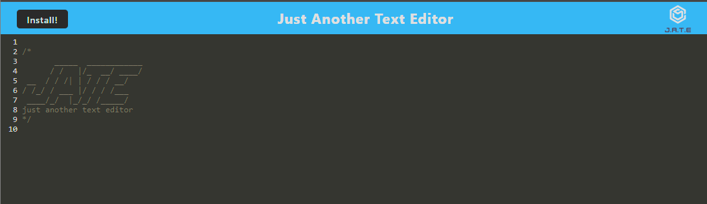

# Just Another Text Editor

Just Another Text Editor, or J.A.T.E, is a Progressive Web App (PWA) designed to provide a simple yet powerful text editing experience. It offers JavaScript syntax highlighting, automatic saving of files on focus loss, and can be accessed both online and offline.

## Table of Contents

- [Features](#features)
- [Preview](#Preview)
- [Usage](#usage)
- [License](#license)
- [Contributing](#contributing)
- [Author](#author)

## Preview

## Features
- **Progressive Web App (PWA)**: Accessible via web browsers and can be installed for offline use.
- **JavaScript Syntax Highlighting**: Enhances code readability and editing experience.
- **Automatic Saving**: Files are saved automatically upon losing focus, ensuring you never lose your work.
- **Cross-Platform Compatibility**: Works seamlessly on various devices and operating systems.

## Usage

1. **Accessing the App**: Visit the URL [Just Another Text Editor](------------) in your web browser.
2. **Editing Text**: Start typing or paste your text into the editor area.
3. **JavaScript Syntax Highlighting**: Enjoy enhanced code readability with syntax highlighting.
4. **Saving Files**: Page is automatically saved when you switch focus or navigate away from the app.

## License
This project is licensed under the MIT License - see the [LICENSE](LICENSE) file for details.

## Contributing
Contributions are welcome! If you would like to contribute to Just Another Text Editor, please fork the repository and submit a pull request with your changes.

## Author

**Jeffrey Scott**

If you have any questions or need further assistance, feel free to [contact me on GitHub](https://github.com/vader9911).

